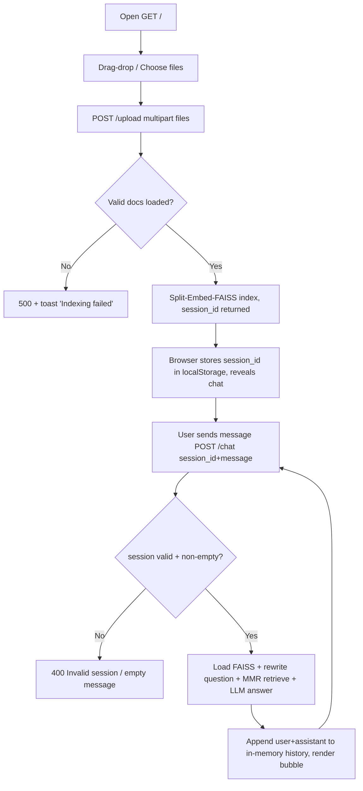
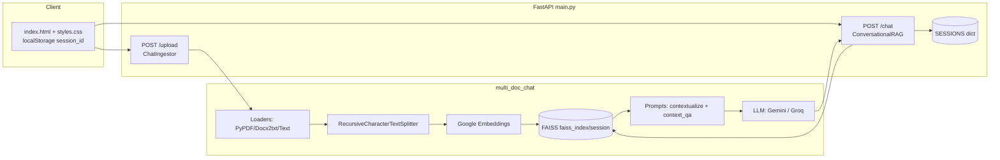

# REQUIREMENTS.md — MultiDocChat (AI-Powered Multi-Document RAG Platform)

> Note: AGENTS.md describes a "mobile project". Actual implementation is a **web application** (FastAPI + Jinja2 + vanilla JS, no mobile client). Requirements below are derived strictly from code.

## 1. Project Overview

MultiDocChat is a session-isolated, multi-document conversational RAG web app. Users upload documents via browser, server chunks/embeds/indexes them into per-session FAISS indexes, then users chat against only their session's documents using an LCEL chain (question contextualization → MMR retrieval → context-grounded QA). Backend: `main.py` (FastAPI `MultiDocChat v0.1.0`). No user authentication; sessions keyed by generated `session_id`.

## 2. Core Features

| # | Feature | Status |
|---|---------|--------|
| F1 | Multi-file document upload + indexing (`POST /upload`) | Implemented |
| F2 | Per-session FAISS vector index (`faiss_index/<session_id>/`) | Implemented |
| F3 | Conversational RAG chat (`POST /chat`) with history-aware rewriting | Implemented |
| F4 | Single-page web UI (upload + chat, `localStorage` session) | Implemented |
| F5 | MMR retrieval (k=5, fetch_k=20, lambda_mult=0.5, hardcoded in `main.py`) | Implemented |
| F6 | Pluggable LLM provider (Google Gemini / Groq) via `LLM_PROVIDER` + `config.yaml` | Implemented |
| F7 | Google embeddings (`gemini-embedding-001`) | Implemented |
| F8 | LangSmith offline evaluation (`run_evaluations.py`: correctness, cot_qa) | Implemented |
| F9 | Health check (`GET /health`), structured logging, custom exception mapping to HTTP codes | Implemented |
| F10 | Broader file-type intake (`.pptx/.md/.csv/.xlsx/.db/.sqlite`) | Partially implemented — accepted by `file_io.py`, silently skipped by `document_ops.load_documents` (only `.pdf/.docx/.txt` loaded) |
| F11 | User auth / authorization, persistent chat history, session cleanup, mobile client | Missing |

## 3. User Flow

## 4. Functional Requirements

| ID | Requirement |
|----|-------------|
| FR1 | System shall accept one or more files via `POST /upload` (`files` form field) and return `{session_id, indexed:true, message}`. |
| FR2 | System shall generate `session_id` as `session_YYYYMMDD_HHMMSS_<8hex>` (`generate_session_id()`). |
| FR3 | System shall persist uploads to `data/<session_id>/`, split with `RecursiveCharacterTextSplitter` (default chunk 1000 / overlap 200), embed, and persist FAISS index to `faiss_index/<session_id>/` (`index.faiss`, `index.pkl`, `ingested_meta.json`). |
| FR4 | System shall deduplicate chunks via `FaissManager._fingerprint` (`source::row_id` or sha256) + `ingested_meta.json`. |
| FR5 | System shall answer `POST /chat` (`{session_id, message}` → `{answer}`) using only the session's FAISS index and in-memory chat history. |
| FR6 | System shall rewrite follow-ups to standalone questions (contextualize prompt), retrieve with MMR, answer with context QA prompt; if context lacks answer, respond `I don't know.`; cap answer at ~3 sentences; validate 1–4096 chars (`ChatAnswer`). |
| FR7 | System shall reject unknown/expired `session_id` with 400 ("Invalid or expired..."), empty message with 400, ingestion/RAG failures with 500 (`DocumentPortalException`). |
| FR8 | UI shall persist `session_id` as `mdc_session_id` in `localStorage`, auto-reveal chat on reload, support Enter-to-send, drag-drop, `Indexing…`/`Thinking…` indicators and toast errors. |
| FR9 | CLI script `run_evaluations.py` shall run RAG over `data/The 2025 AI Engineering Report.txt` (or `--dataset`) against LangSmith datasets with `correctness` (Gemini 2.5 Pro judge) / `cot_qa` / `all` evaluators. |

## 5. Screens

Single route `GET /` → `templates/index.html` (styled by `static/styles.css`). Two stacked sections:

| Screen section | Purpose | Main UI elements | User actions | Data used | Navigation |
|---|---|---|---|---|---|
| Uploader (`#uploader`) | Document intake | `#dropzone`, `#file-input` (multiple, hidden), `#upload-btn`, `#indexing` hint | Drag-drop files, choose files, Upload & Index | `FormData(files)` → `POST /upload` | On success reveals `#chat` |
| Chat (`#chat`, hidden until session) | Q&A over uploaded docs | `#messages` (`.bubble.user/.assistant`), `#message-input`, `#send-btn`, `#thinking` hint, `#toast` | Type/send, Enter-send, scroll history | `{session_id, message}` → `POST /chat`; `localStorage.mdc_session_id` | None (single page) |

## 6. Data Requirements

| Entity | Fields | Source |
|---|---|---|
| Session | `session_id` (PK, generated), history `[{role: user\|assistant, content}]` | Server `SESSIONS: Dict[str, List]` (in-memory, lost on restart); `localStorage` on client |
| Uploaded file | sanitized name `<uuid8><ext>`, bytes | `data/<session_id>/` |
| Text chunk | `page_content`, `metadata{source, page/row}` | `RecursiveCharacterTextSplitter` output |
| FAISS index | `index.faiss`, `index.pkl`, `ingested_meta.json{rows:{fingerprint:true}}` | `faiss_index/<session_id>/` |
| Chat I/O | `ChatRequest{session_id,message}`, `ChatResponse{answer}`, `UploadResponse{session_id,indexed,message?}` | Pydantic models in `main.py` / `model/models.py` |
| Config | `embedding_model{provider,model_name}`, `retriever{top_k,search_type,fetch_k,lambda_mult}`, `llm.groq|google{provider,model_name,temperature,max_output_tokens}` | `multi_doc_chat/config/config.yaml` (+ `CONFIG_PATH` override) |

Relationships: `Session 1—* Uploaded file; Session 1—1 FAISS index; Session 1—* Chat turns (ordered)`. No ER diagram — flat session-scoped filesystem store, no relational joins.

## 7. API / Integration Requirements

| API | Request | Response | Errors |
|---|---|---|---|
| `GET /` | — | `index.html` (HTML) | Unknown |
| `GET /health` | — | `{"status":"ok"}` | — |
| `POST /upload` | `multipart/form-data: files[]` | `UploadResponse` (e.g. `{"session_id":"…","indexed":true,"message":"Indexing complete with MMR"}`) | 400 no files (unreachable via UI; empty list → 422), 500 ingestion failure |
| `POST /chat` | JSON `{session_id, message}` | `{"answer": str}` | 400 invalid session / empty message, 500 load/invoke failure |

External services:

* **Google Generative AI** — embeddings (`gemini-embedding-001`) + default LLM (`config.yaml` `llm.google.model_name`, currently literal `"gemini-3.6-flashpython test.py"` — malformed value in repo). Key: `GOOGLE_API_KEY`.
* **Groq** — alt LLM (`openai/gpt-oss-20b`, temp 0, 2048 tokens). Selected via `LLM_PROVIDER` env (default `google`). Key: `GROQ_API_KEY`. OpenAI provider code is commented out.
* **LangSmith** — `evaluate()` with custom `correctness_evaluator` (Gemini 2.5 Pro judge, score 0/1) and `LangChainStringEvaluator("cot_qa")`. Requires `LANGSMITH_API_KEY` + `GOOGLE_API_KEY`.
* **Auth** — none for end users. Service keys via `.env` (local) / env vars / ECS JSON secret `apikeyliveclass`; both `GROQ_API_KEY` + `GOOGLE_API_KEY` mandatory at startup (`ApiKeyManager`). CORS open (`*`).

## 8. Non-Functional Requirements

* **Performance:** per-chat FAISS index reloaded from disk on every request (`load_retriever_from_faiss`); chunk/embed params tunable. No caching/pagination. No numeric targets in code.
* **Security:** no auth, permissive CORS, `FAISS.load_local(allow_dangerous_deserialization=True)`, API keys only prefix-logged. Production suitability: Unknown / not hardened.
* **Reliability:** structured JSON logs (`structlog` → `logs/` + stdout); all RAG paths wrapped in `DocumentPortalException` (file+line+traceback) → 500. In-memory `SESSIONS` resets on restart — chat continuity not guaranteed.
* **Scalability:** session dirs isolate data but accumulate without cleanup/TTL; single-process `uvicorn` (Docker `8080`, `--reload`); multi-worker safety Unknown.
* **Usability:** responsive single page, light/dark `color-scheme`, toasts + busy indicators; answers constrained to ≤3 sentences.

## 9. Current Limitations

1. **Not mobile** — no native/mobile client; UI is desktop-oriented fixed-width web page.
2. **Volatile history** — `SESSIONS` in-memory only; restart invalidates sessions though `data/`/`faiss_index/` remain.
3. **File-type gap** — `file_io.SUPPORTED_EXTENSIONS` (11 types) vs `document_ops` loaders (3 types); e.g. `.csv/.md/.pptx` saved then ignored, can yield "No valid documents loaded".
4. **Double-write in `built_retriver`** — `load_or_create(texts…)` already creates+saves index, then `add_documents(chunks)` re-adds same chunks (dedup meta only partly mitigates).
5. **Dead code / bugs** — `file_io.py` computes `safe_name` fname then immediately overwrites with uuid-only name; `FastAPIFileAdapter.getbuffer()` in `main.py` incompatible with `file_io.save_uploaded_files` Starlette branch (works only via fallback); config `gemini-3.6-flashpython test.py` malformed; `main.py` hardcodes MMR params ignoring `config.yaml retriever.top_k`.
6. **No auth, no cleanup, no pagination/streaming**; answer length cap (4096) can truncate; `test.py` references absolute local path `D:/LLMOps_series-main/…` (non-portable); Jenkins/Docker files (`Dockerfile.jenkins`, `docker-compose.jenkins.yml`) present but orchestration behavior Unknown from code alone.

## 10. Project Architecture

LCEL conversational RAG behind thin FastAPI layer; filesystem as session store.

Major components: `main.py` (routes, session dict, file adapter); `src/document_ingestion/data_ingestion.py` (`ChatIngestor`, `FaissManager`); `src/document_chat/retrieval.py` (`ConversationalRAG` LCEL chain); `utils/{model_loader,file_io,document_ops,config_loader}`; `prompts/prompt_library.py`; `model/models.py`; `run_evaluations.py`; `tests/{unit,integration}` (stubbed LLM/embeddings); `Dockerfile`, `docker-compose.jenkins.yml`.
